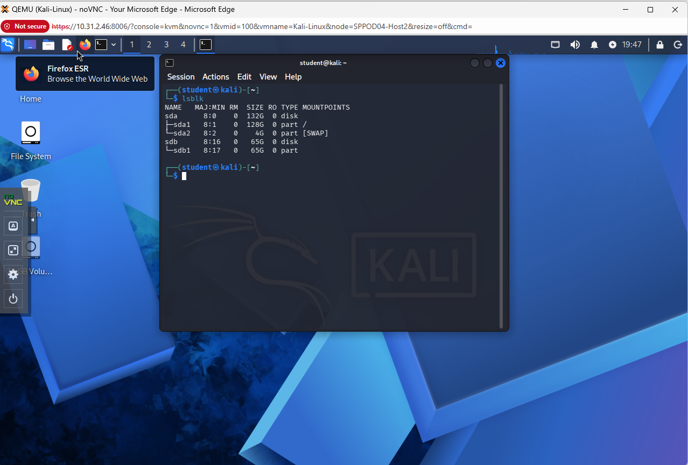
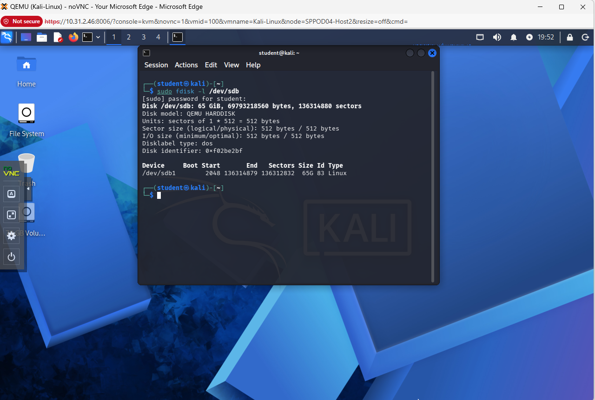
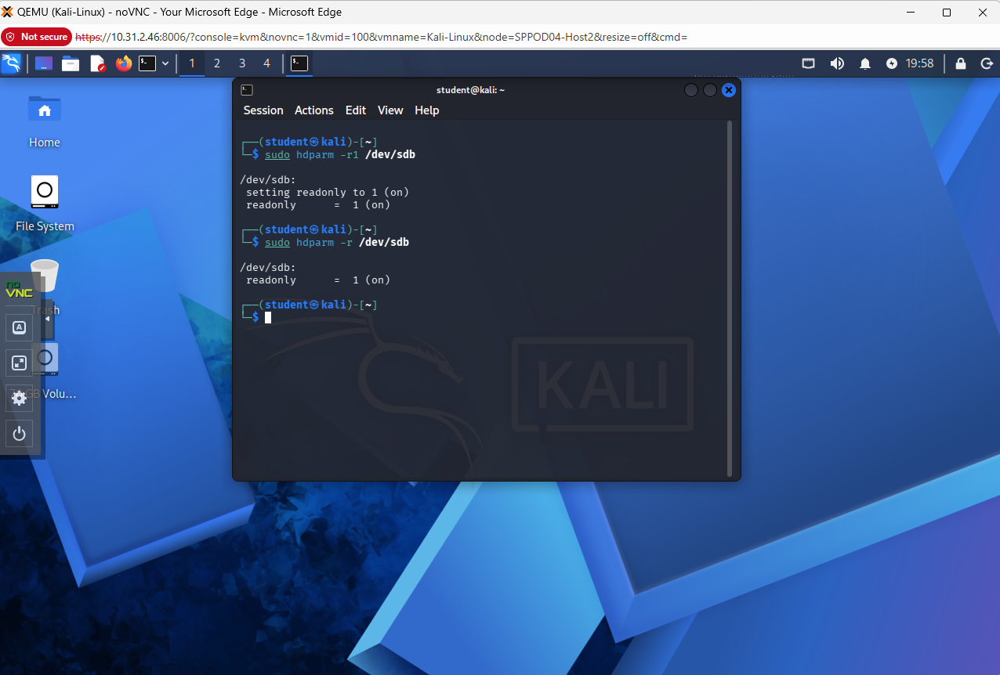

# Digital-Forensics-Evidence-Acquisition
Forensic disk imaging and hash verification using MD5 and SHA-256 in Kali Linux.

## 📌 Objective
The objective of this project was to acquire a forensic image of storage media and verify its integrity using cryptographic hashing algorithms. This ensures the image is an exact duplicate of the original evidence and has not been altered.

## 🛠 Tools & Environment

- Windows 11
- Kali Linux (Virtual Machine – VirtualBox)
- dd (disk imaging utility)
- MD5 hashing
- SHA-256 hashing
- SCP (Secure Copy Protocol)

## 🔍 Procedure

### 1️⃣ Identify the Evidence Disk

List attached disks:

```
lsblk
```

View detailed disk information:

```
sudo fdisk -l /dev/sdb
```

Confirmed `/dev/sdb` was the evidence disk and `/dev/sda` was the system disk.

---

### 2️⃣ Implement Software Write Blocking

Check if disk is mounted:

```
mount | grep /dev/sdb
```

Unmount if necessary:

```
sudo umount /dev/sdb1
```

Enable read-only mode:

```
sudo hdparm -r1 /dev/sdb
```

Verify read-only status:

```
sudo hdparm -r /dev/sdb
```

---

### 3️⃣ Create Forensic Image

Create storage directory:

```
mkdir -p /home/student/forensics
```

Perform sector-level imaging:

```
sudo dd if=/dev/sdb of=/home/student/forensics/craig_tucker_desktop.img bs=4M status=progress
```

---

### 4️⃣ Hash Verification (Kali Linux)

Generate MD5 hash of original disk:

```
sudo md5sum /dev/sdb > /home/student/forensics/original_md5.txt
```

Generate MD5 hash of forensic image:

```
md5sum /home/student/forensics/craig_tucker_desktop.img > /home/student/forensics/image_md5.txt
```

Compare MD5 values:

```
cat /home/student/forensics/original_md5.txt
cat /home/student/forensics/image_md5.txt
```

Generate SHA-256 hash of original disk:

```
sudo sha256sum /dev/sdb > /home/student/forensics/original_sha256.txt
```

Generate SHA-256 hash of forensic image:

```
sha256sum /home/student/forensics/craig_tucker_desktop.img > /home/student/forensics/image_sha256.txt
```

Compare SHA-256 values:

```
cat /home/student/forensics/original_sha256.txt
cat /home/student/forensics/image_sha256.txt
```

Matching hash values confirmed image integrity.

---

### 5️⃣ Secure Transfer to Windows

Identify Kali IP address:

```
ip addr
```

Transfer image using SCP from Windows PowerShell:

```
scp student@10.31.2.227:/home/student/forensics/craig_tucker_desktop.img C:\Cases\
```

---

### 6️⃣ Verify Integrity After Transfer (Windows)

Generate MD5 hash in PowerShell:

```
Get-FileHash -Algorithm MD5 C:\Cases\craig_tucker_desktop.img
```

Confirmed Windows MD5 hash matched Kali MD5 hash.

---

### 7️⃣ Documentation

Recorded disk details, acquisition timestamps, hash values, and verification results to preserve forensic integrity and support chain-of-custody requirements.

---

## 🧠 Why This Matters

Cryptographic hashing ensures digital evidence integrity. Matching hash values confirm the forensic image is an exact duplicate of the original storage media. Proper documentation and verification procedures are critical in forensic investigations to ensure evidence remains admissible and defensible.
